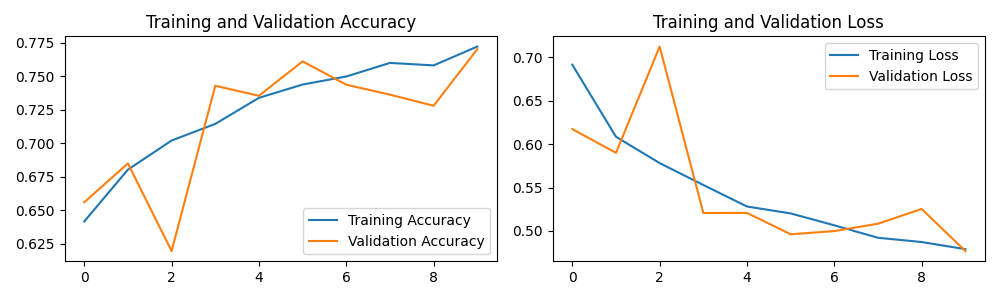

# Noventiq assingment test Computer Vision

Task: Make a project to classify the presence of St. George in the image.
There are two files with a list of pictures in the folder: with St. Georgies and without.

# Methodology

At first, a simple binary/dichotomous neural network classifier was used, sequentially allocating convolutional layers and max pooling layers. The first layer is a rescaling layer, transforming the interval of images from [0,255] to [0,1], and the last layer has a relu activation function.

Generally, 10 epochs were used, but in a production-model trained in a cloud environment, more epochs could be used.

Since initially the model presented overfitting, data augmentation and dropout regularization were applied. The resulting model had a smooth evolution of training accuracy, and an increase in validation accuracy, whereas the first model had a abrupt increase in training accuracy and a decay in validation accuracy.

The image below demonstrates the history of training for the model with data augmentation and dropout:

In order to use the tf.keras.utils functions to sample data, the images resulting from URLs were stored in a folder for each class.

The notebook with the initial studies can be found in the file "Noventiq_assignment_CV.ipynb".

# Training and Inference

The model is trained with the src/main.py module, and the prediction can be performed with the function in src/predict.py.

# Directory structure
- Auxiliary functions are allocated in src/utils.py
- Data visualization related scripts are in src/plots.py
- Converting the model to tflite and saving can be found in src/save_model.py
- To create the necessary folders and extract the images into a folder, use src/setup_dir.py
- The model is in src/models.py
- A function to load the URL-databases is in src/load_data.py
- The requirements.txt file contains the versions utilized to execute this project in a local environment (fresh virtualenv). It is also possible to run the project in the Google Colaboratory notebook "Noventiq_assignment_CV.ipynb", which already has a considerable amount of libraries imported. It is recommended to create a virtualenv to execute this project.

# Disclaimer / Privacy Notice
- All outputs with images were deleted, for privacy reasons.
- The datasets and images were not uploaded to this repository, for privacy reasons.
- This project is protected with a MIT LICENSE.
- The following reference were utilized to support this study.

# References

1. https://www.tensorflow.org/tutorials/images/classification
2. https://medium.com/edureka/tensorflow-image-classification-19b63b7bfd95